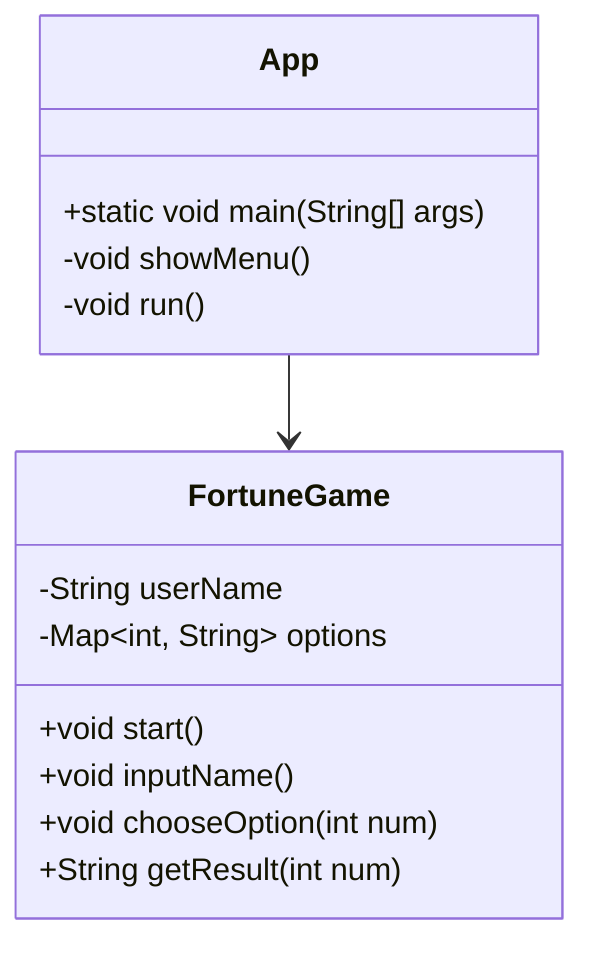

# Sumin_Is_Leader

|역할|이름|
|--|--|
|팀장|수민|
|조수|지윤|

## Project Name:너의 운을 시험하라

목적: 사용자가 오늘의 운세를 확인할 수 있다

작동법
- 프로그램 시작 시 시작과 종료가 나온다
- 사용자가 시작을 누른다
- 입력창이 뜨면 사용자는 본인의 이름을 입력
- 5개의 보기 제공
- 이 보기는 작성자가 미리 작성한다
- 사용자는 보기 하나 선택
- 사용자의 이름과 보기에 따른 결과 출력 
  >[ex] **oo님의 오늘의 운세는 '결과'입니다.**
  
  
- 보기는 총 5개로 
> **1. 미용실**   
> **2. 괴정**   
> **3. 아샷추**  
> **4. 고체가글**  
  **5.얼박사**  

- 각 보기마다 답이 정해져있음
-  결과

    > **1: 최고의 하루를 보낼것입니다 😎**   
      **2: 최악의 하루가 당신을 기다릴것입니다😵**   
      **3: 피곤한 하루가 당신을 기다릴것입니다🥱**  
      **4: 바쁜 하루가 당신을 기다릴 것입니다⏰**     
      **5: 재밌는 하루가 당신을 기다릴 것입니다😆**   

종료를 누르면 종료됨

---

